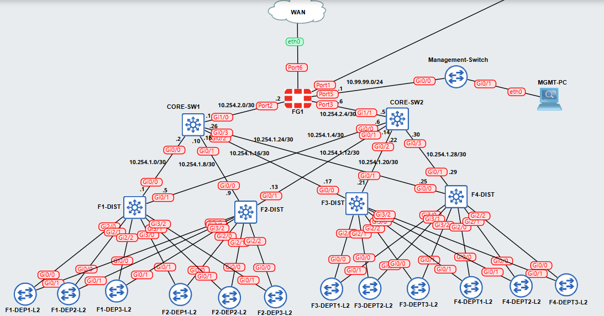

# Enterprise 3-tier Network Infrastructure Lab 🛠️

**Author:** El Mahdi ARFAL  
**Academic Year:** 2025/2026  
**Institution:** Institut National des Postes et Télécommunications  

---

## Table of Contents
- [Project Overview](#project-overview)
- [Network Architecture](#network-architecture)
- [Devices Used](#devices-used)
- [Features Implemented](#features-implemented)
- [Protocols & Technologies](#protocols--technologies)
- [Addressing Scheme](#addressing-scheme)
- [VLAN Configuration](#vlan-configuration)
- [Objectives & Learning Outcomes](#objectives--learning-outcomes)
- [Requirements](#requirements)
- [Files & Repository Structure](#files--repository-structure)
- [How to Import/Run in GNS3](#how-to-importrun-in-gns3)

---

## 🚀 Project Overview

A hands-on GNS3 lab implementing a comprehensive enterprise network infrastructure spanning four floors with redundant distribution layers, core switching, and centralized management. The network features hierarchical design principles with access, distribution, and core layers, providing high availability, scalability, and security.

The infrastructure includes:
- **4 Floors** with departmental segmentation
- **12 Access Layer Switches** (3 per floor)
- **4 Distribution Layer Switches** (one per floor)
- **2 Core Layer Switches** for redundancy
- **1 Management Switch** for network administration
- **FortiGate Firewall** for security and internet connectivity

## 🌐 Network Architecture

### Topology



### Layer Functions:
- **Core Layer:** High-speed packet forwarding between distribution layers
- **Distribution Layer:** Policy enforcement, routing, VLAN aggregation, redundancy
- **Access Layer:** End-user connectivity, VLAN segmentation, port security

## Devices Used

| Device Type    | Quantity | IOS Image                                       | Role                |
|----------------|----------|-------------------------------------------------|---------------------|
| Cisco IOSvL2   | 19       | viosl2-adventerprisek9-m.SSA.high_iron_20180619 | Switches            |
| FortiGate      | 1        | fortinet-FGT-v7.0.10.M-build0450                | Firewall            |

## Features Implemented

### Switching Features
- **VLAN Trunking Protocol (VTP)** with domain "LOTM"
- **Rapid PVST+** for loop prevention
- **PortFast** and **BPDU Guard** on access ports
- **VLAN Segmentation** per department
- **Management VLAN (99)** for out-of-band management

### Routing Features
- **OSPF** for dynamic routing across all layers and FortiGate Firewall
- **HSRP/VRRP** for gateway redundancy
- **Inter-VLAN Routing** at distribution layer

### Security Features
- **SSH-only** remote access
- **Local authentication** with privilege levels
- **Password encryption**
- **Port security** with BPDU Guard
- **VTP password** protection
- **FortiGate Security**
- *Note: All passwords are :* **lotm**

### FortiGate Integration
- Dual connections to core switches (internal network)
- Management interface connected to management switch
- OSPF routing with internal network
- Security zones and policies
- Interface redundancy with core layer

### Redundancy Features
- **Dual-homed** access to distribution switches
- **Dual core** switches with equal-cost paths
- **HSRP** for default gateway redundancy
- **STP Root Bridge** optimization

## Protocols & Technologies

### Layer 2 Protocols
- **IEEE 802.1Q** (VLAN Trunking)
- **VTP** (VLAN Trunking Protocol)
- **Rapid PVST+** (Spanning Tree)
- **HSRP** (Hot Standby Router Protocol)

### Layer 3 Protocols
- **OSPF** (Open Shortest Path First)
- **IP Routing** with CIDR
- **Subnetting** for efficient address allocation

### Management Protocols
- **SSHv2** for secure CLI access
- **TCP/IP** for network management
- **DNS** with domain "entreprise.local"

## 🌍 Addressing Scheme

### Management Network
- **Subnet:** 10.99.99.0/24
- **Gateway:** 10.99.99.1
- **Devices:** All network infrastructure devices

### Core-Distribution Links
- **Subnet:** 10.254.1.0/24 (divided into /30 subnets)
- **Purpose:** Point-to-point links between core and distribution switches

### Core-Fortigate Links
- **Subnet:** 10.254.2.0/30 and 10.254.2.4/30
- **Purpose:** Connections to firewall

### Department VLANs

| Floor | Department | VLAN | Subnet        | HSRP VIP    |
|-------|------------|------|---------------|-------------|
| 1     | Dept1      | 10   | 10.1.10.0/24  | 10.1.10.1   |
| 1     | Dept2      | 11   | 10.1.11.0/24  | 10.1.11.1   |
| 1     | Dept3      | 12   | 10.1.12.0/24  | 10.1.12.1   |
| 2     | Dept1      | 20   | 10.2.20.0/24  | 10.2.20.1   |
| 2     | Dept2      | 21   | 10.2.21.0/24  | 10.2.21.1   |
| 2     | Dept3      | 22   | 10.2.22.0/24  | 10.2.22.1   |
| 3     | Dept1      | 30   | 10.3.30.0/24  | 10.3.30.1   |
| 3     | Dept2      | 31   | 10.3.31.0/24  | 10.3.31.1   |
| 3     | Dept3      | 32   | 10.3.32.0/24  | 10.3.32.1   |
| 4     | Dept1      | 40   | 10.4.40.0/24  | 10.4.40.1   |
| 4     | Dept2      | 41   | 10.4.41.0/24  | 10.4.41.1   |
| 4     | Dept3      | 42   | 10.4.42.0/24  | 10.4.42.1   |

### Loopback Addresses
- **Core Switches:** 10.255.10.1/32 and 10.255.10.2/32
- **Distribution Switches:** 10.255.1.1/32 to 10.255.4.1/32

## VLAN Configuration

### VLAN Assignments
- **VLAN 10-12:** Floor 1 Departments
- **VLAN 20-22:** Floor 2 Departments  
- **VLAN 30-32:** Floor 3 Departments
- **VLAN 40-42:** Floor 4 Departments
- **VLAN 99:** Management (All devices)

### VTP Configuration
- **Domain:** LOTM
- **Password:** lotm
- **Version:** 2
- **Mode:** Server (Distribution), Client (Access), Transparent (Core)

## ✅ Objectives & Learning Outcomes

### Technical Objectives
- Design and implement a scalable enterprise network infrastructure
- Configure hierarchical network design with access, distribution, and core layers
- Implement VLAN segmentation for departmental isolation
- Configure dynamic routing with OSPF for optimal path selection
- Implement high availability with HSRP and redundant links
- FortiGate firewall integration and policy configuration

### Learning Outcomes
- Understanding of enterprise network design principles
- Proficiency in Cisco IOS configuration and troubleshooting
- Experience with layer 2 and layer 3 protocols integration
- Skills in network redundancy and high availability design
- Knowledge of security best practices in network infrastructure

## ⚠️ Requirements

### Software Requirements
- **GNS3**
- **GNS3 VM**
- **VMware Workstation/Fusion** or **VirtualBox**

### IOS Images Required
- **Cisco IOSv 15.9(3)M9** (vios-adventerprisek9-m.spa.159-3.m9)
- **Cisco IOSvL2 15.2.1** (viosl2-adventerprisek9-m.SSA.high_iron_20180619)
- **FortiGate 7.0.10** (fortinet-FGT-v7.0.10.M-build0450)

### Hardware Requirements
- **RAM:** Minimum 12GB
- **Storage:** 20GB free space
- **CPU:** Multi-core processor for virtualization

## 📁 Files & Repository Structure

```
enterprise-network-infrastructure/
│
├── Configuration-Files/
│ ├── Management-Switch.txt
│ ├── ACC-SWITCHES-ALL.txt
│ ├── CORE-SW1.txt
│ ├── CORE-SW2.txt
│ ├── F1-DIST.txt
│ ├── F2-DIST.txt
│ ├── F3-DIST.txt
│ └── F4-DIST.txt
│
├── README.md
├── enterprise-network.gns3
└── topology.png
```


## ⚙️ How to Import/Run in GNS3

### Step 1: Prepare GNS3 Environment
1. Install GNS3 and GNS3 VM  
2. Import required IOS images:  
   - Cisco IOSvL2 15.2.1  
   - FortiGate 7.0.10  

### Step 2: Import Project
1. Open GNS3 and import the project file:  
File → Import project(s)  
Select `enterprise-network-3tier.gns3` from GNS3-Project repo folder

### Step 4: Verification
- Verify connectivity between devices:  
`ping <ip-address>`

- Check OSPF neighbors:  
`show ip ospf neighbor`

- Verify VLAN database:  
`show vlan brief`

- Check HSRP status:  
`show standby brief`

### Step 5: Testing
- Test inter-VLAN routing  
- Verify redundancy by disconnecting primary links  
- Test management access via SSH
